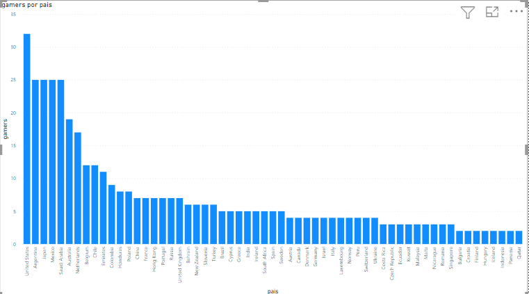
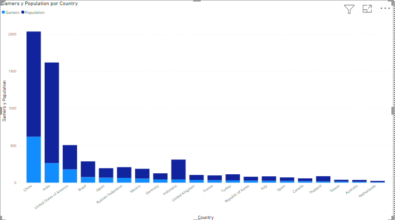
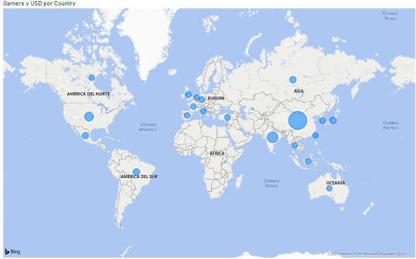

# Videojuegos en Línea por paises.
## 1. Arquitectura
Los datos son extraidos por fuentes online como statista y gamstat, los data set seran obtenidos en formato csv y posteriormente seran importados a SQL Server para su almacenamiento. 
para el analisi de los datos sera necesario usar las propias funciones del Power BI ya que permite exportar bases de datos enteras de SQL Server para su analisis y graficos de los mismos.
## 2. extracción
### Statista
### Gamstat
## 3. Visualizaciones
### Jugadores de Call of Duty WarZone por paises
 
**Análisis:** en la grafica se presenta los jugadores por millones que existe dentro de cada pais, enfocado unicamente en la plataforma de juego online de WarZone.
Se puede observar que el juego a tenido mas acogida por algunos paises latino Americanos y Estados Unidos.
Por su contraparte los paises orientales son los que menos registros tienen.
### Poblacion general Vs poblacion gamer por pais.
 
**Análisis:** La grafica muestra el indice de diferencia que hay entre la poblacion general del pais contra los games en plataformas online de cada pais.
el pais que registra actividades en juegos online es China.
### Juegos por Género
 
**Análisis:** La grafica muestra el nivel de ingresos economicos que genera la poblacion gamer por paises, mostrando que chica es el mayor consumidor de juegos en plataformas online
